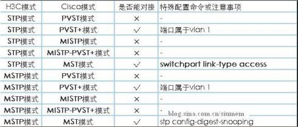
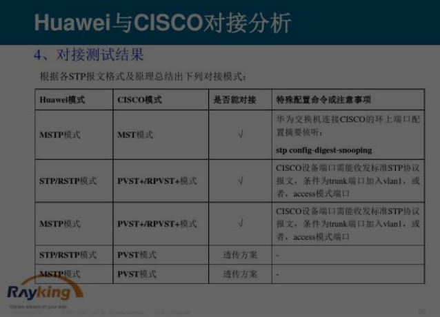

## cisco config
mac
```
SW4#ping 10.1.1.5
Sending 5, 100-byte ICMP Echoes to 10.1.1.5, timeout is 2 seconds:
  < press Ctrl+C to break >
!!!!!
Success rate is 100 percent (5/5), round-trip min/avg/max = 1/1/1 ms.

cisco#show arp complete
Protocol  Address          Age(min)  Hardware        Type   Interface               
Internet  10.1.1.5      0         00e2.6907.71cf  arpa   VLAN 10                
Total number of complete entries: 1

cisco#show mac-address-table
Vlan        MAC Address          Type     Interface                      Time
----------  -------------------- -------- ------------------------------ --------------------
 10        00e2.6907.71cf       DYNAMIC  GigabitEthernet 0/17           2018-4-13 17:15:38 
cisco#

```

```
   CISCO	   描述
   no	   取消、关闭当前设置
   show	   显示查看
   exit	   退回上级
   hostname	   设置主机名
   en, config terminal	   进入全局模式
   delete	   删除文件
   reload	   重启
   write	   保存当前配置
   username	   创建用户
   shutdown	   禁止、关闭 端口
   show version	   显示当前系统版本
   show startup-config	   查看已保存过的配置
   show running-config	   显示当前配置
   no debug all	   取消所有debug命令
   erase startup-config	   删除配置
   end	   退到用户视图
   exit	   登出
   logging	   指定信息中心配置信息
   line	   进入线路配置（用户接口）模式
   start-config	   启动配置
   running-config	   当前配置
   host	   host名字和ip地址对应
   交换部分	   交换部分
  enable password	   配置明文密码
interface type/number	   进入接口
   interface vlan 1	   进入vlan配置vlan管理地址
   interface rang	   定议多个端口的组
   enabl esecret	   设置特权口令
   duplex (half|full|auto)	   配置接口状态
   speed (10/100/1000)	   配置端口速率
   switchport mode trunk	   配置trunk
   vlan ID /no vlan ID	   添加、删除vlan
   switchport access  vlan	   将端口接入vlan
   show interface	   查看接口
   show vlan ID	   查看vlan
   encapsulation	   封装协议
  channel-group 1 mode on	   链路聚合
   ip routing	   开启三层交换的路由功能
   no switchport	   开启接口三层功能
   vtp domain	   对跨以太网交换机的VLAN进行动态注册和删除
   spanning-tree vlan ID  root primary	   stp配置根网桥
   spanning-tree vlan ID  priority	   配置网桥优先级
   show spanning-tree	   查看STP配置
   路由部分	   路由部分
   ip route 0.0.0.0  0.0.0.0	   配置默认路由
   ip route 目标网段+掩码 下一跳	   配置静态路由
   show ip route	   查看路由表
   router rip /network 网段	   启用rip、并宣告网段
   router ospf	   启用ospf
   network ip 反码 area <area-id>	   配置OSPF区域
   no auto-summary	   配置RIP V2水平分割
   show ip protocol	   查看路由协议
   access-list 1-99  permit/deny IP	   标准访问控制列表
   access-list 100-199  permit/deny protocol source IP+反码  destination IP+反码 operator operan	   扩展访问控制列表
   standby group-number  ip virtual-ip	   配置HSRP组
   standby group-number  priority	   配置HSRP优先级
   standby group-number  preempt	   配置HSRP占先权
   standby group-number  track	   配置端口跟踪
   ip nat inside source  static	   配置静态地址转换
```

