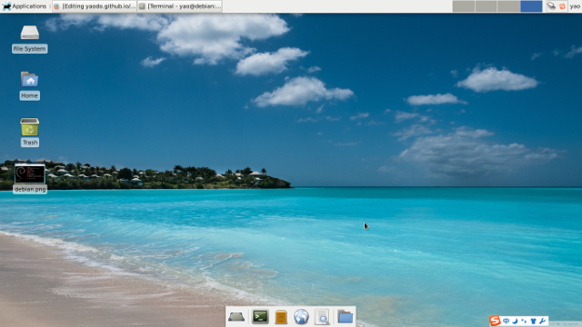

## debian install & config


1. 下载第1张dvd安装，采用xfce桌面，修改apt为网络源
2. Firefox emacs git
3. 搜狗拼音输入法
4. 网易云音乐 mplayer
5. 卸载lroffice




6. 如果需要，改为中文界面
在桌面上需要，服务器一般不怎么动这个。。
编辑/etc/environment文件，添加以下内容
```
LANG=zh_CN.UTF-8
LANGUAGE=zh_CN:zh
LC_CTYPE="zh_CN.UTF-8"
LC_NUMERIC="zh_CN.UTF-8"
LC_TIME="zh_CN.UTF-8"
LC_COLLATE="zh_CN.UTF-8"
LC_MONETARY="zh_CN.UTF-8"
LC_MESSAGES="zh_CN.UTF-8"
LC_PAPER="zh_CN.UTF-8"
LC_NAME="zh_CN.UTF-8"
LC_ADDRESS="zh_CN.UTF-8"
LC_TELEPHONE="zh_CN.UTF-8"
LC_MEASUREMENT="zh_CN.UTF-8"
LC_IDENTIFICATION="zh_CN.UTF-8"
LC_ALL=
```

然后将其导入当前终端：
$ source /etc/environment
即可将语言改为中文，并且无需重启。
