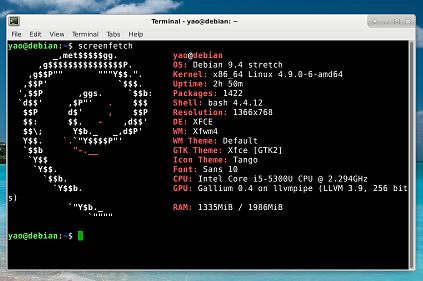

### Cloud Note,Hi

###To save something useful.linux,rs.python program 
###python

### Cloud 
|:-    |:-    |:-    |:-    |
|[k8scon](conjure-up.html)| [openstack](openstack.html)|[hadoop](hadoop.html)||
### linux config

|:-    |:-    |:-    |:-    |
|[shell](linux/shell.html)|[vsftpd](linux/yum.html)|[ntp](linux/ntp.html)|[iptables](linux/iptables.html)|
|[iptables1](linux/iptables1.html)|[openssl8](linux/opensslssh.html)|[debian](linux/debian1.html)|[7firewalld](linux/firewalld.html)|


### Router Switch
|:-    |:-    |:-    |:-    |
|[cisco](net/cisco1.html)|[jupiter](net/jupiter.html)|[huawei](net/huawei.html)|[h3c](net/h3c1.html)|
|[gns3](net/gns.html)||||

### remote ssh

|:-    |:-    |:-    |:-    |
|[ssh](ssh.html)|[fabric](fabric.html)|[puppet](puppet.html)|[ansible](ansible.html)|

### troubleshooting

|:-    |:-    |:-    |:-    |
|[tcpdump](linux/tcpdump.html)|[nettools](linux/nettools.html)|[wiresharks](linux/wiresharks.html)||


### vpn

|:-    |:-    |:-    |:-    |
|[shadowsocks](ss.html)|[openvpn](openvpn.html)|||


[Link](url) and 

```
    
```

Commands

```
    hello
、、、
